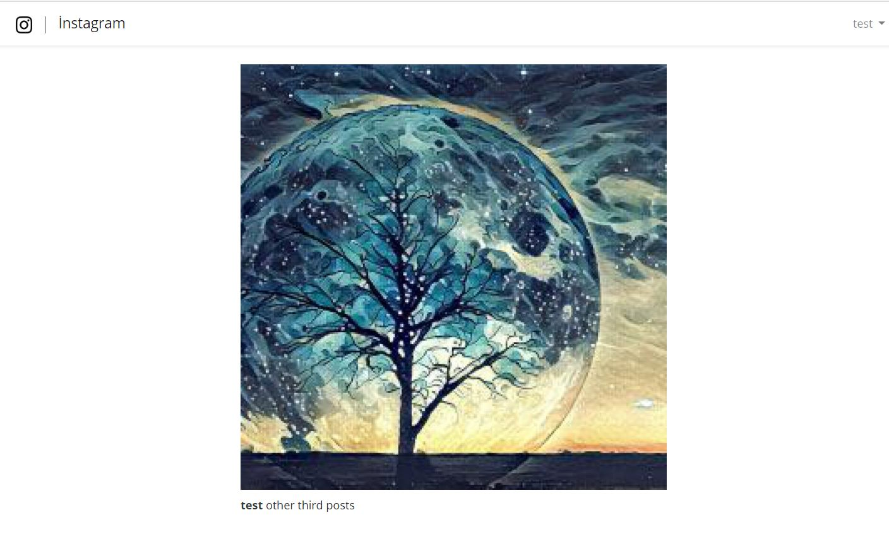

### Instagram Application 🎉

A similar instagram application.It allows you to share posts, follow someone and see your friends posts.

Technologies used;

✔️ Laravel 6.16.0 as framework

✔️ Composer for dependency management

✔️ Mysql 5.7.12 for database management

✔️ Laravel Passport for authentication

✔️ Laravel Pagination to list posts

    

    

    

    

### Installation

- Clone the repository and go to project directory.

        git clone https://github.com/elevliaykut/instagramclone.git

        cd instagramclone

- Rename .env.example to .env

- Connect to MySQL and create a database.

        mysql -u root -p

        create database 'instagramclone'

- Update the .env file with database connection details.

        DB_DATABASE=instagramclone
        DB_USERNAME=username
        DB_PASSWORD=password

- After setting the environment, run the build.sh

        sh build.sh

and you're all done! You have startted the server on http://127.0.0.1:8000/

