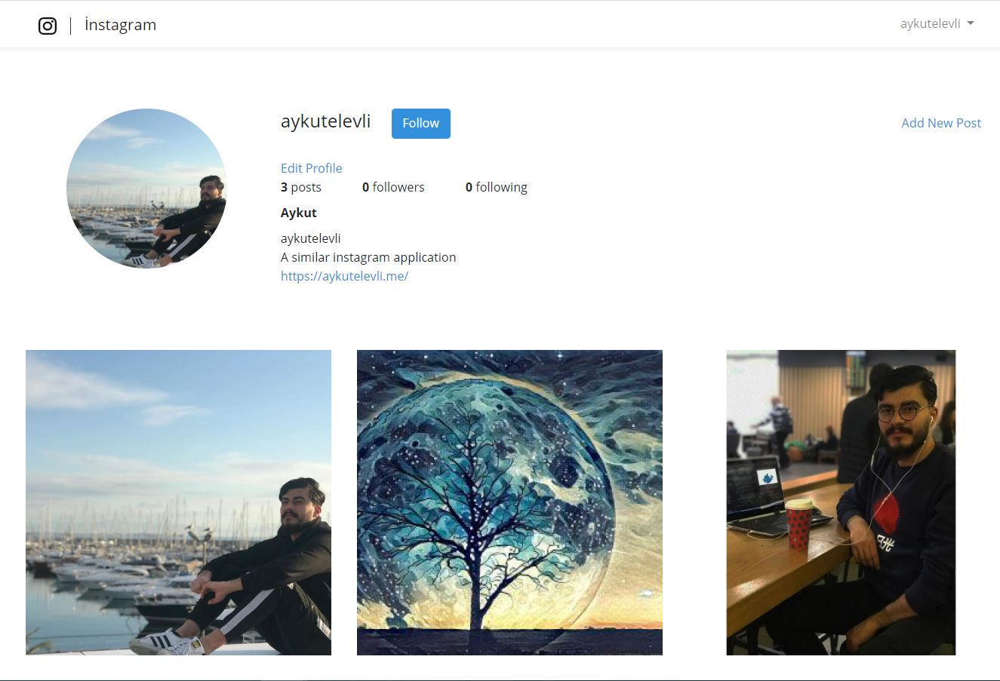
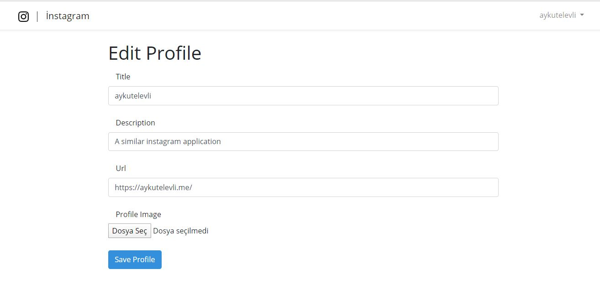
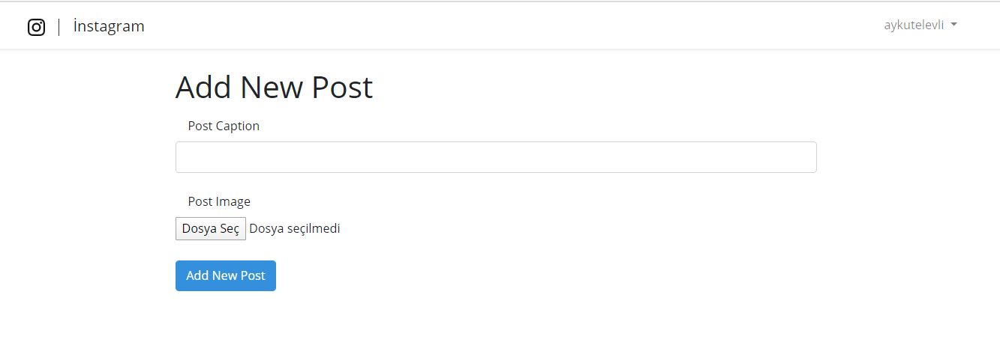

### Instagram Application

A similar instagram application.It allows you to share posts, follow someone and see your friends posts.

Technologies used;

✔️ Laravel 6.16.0 as framework

✔️ Composer for dependency management

✔️ Mysql 5.7.12 for database management

✔️ Laravel Passport for authentication

✔️ Laravel Pagination to list posts

    

    

    

